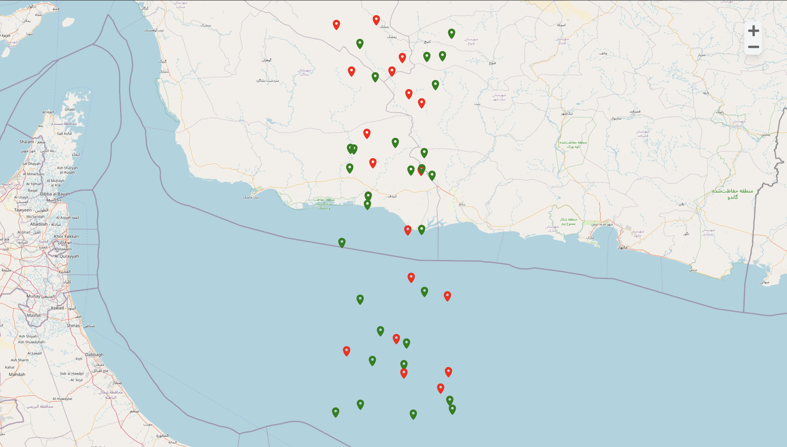
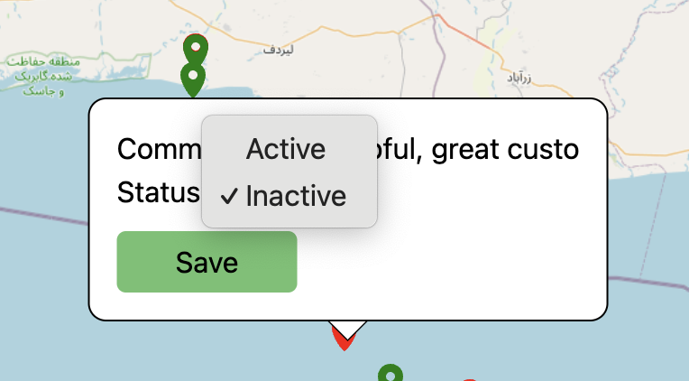
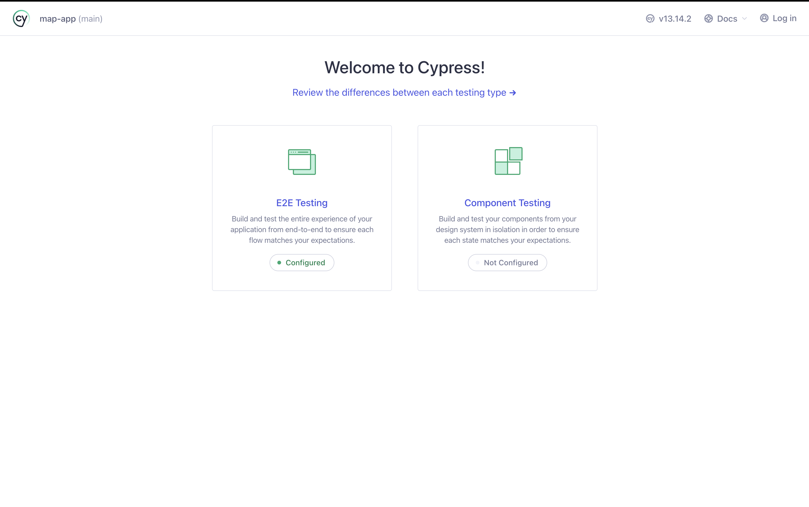
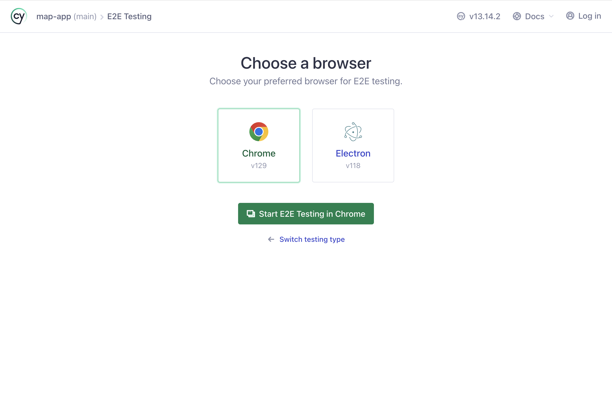
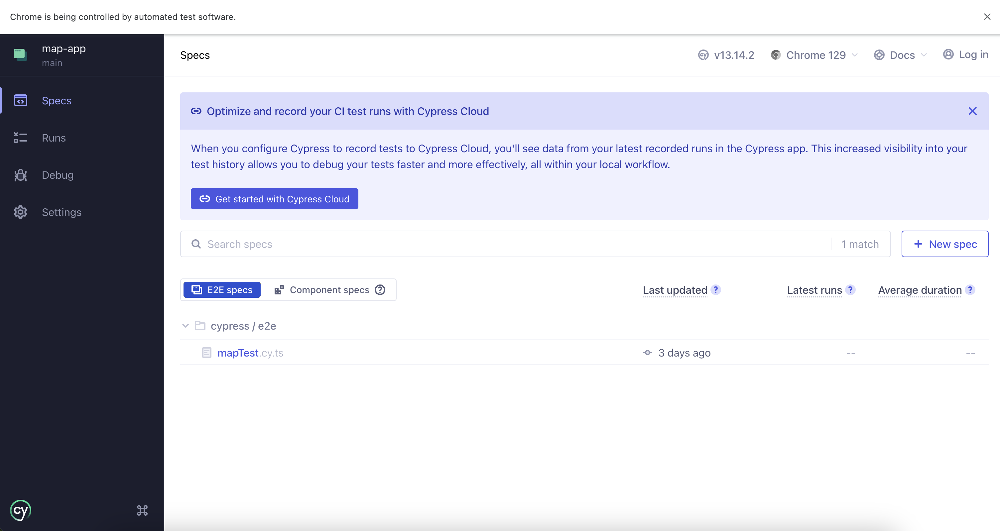

```markdown
# React Vite Project

## Instructions to Launch the Project

1. **Pull the project from GitHub:**
    ```sh
    git pull <https://github.com/uraden/map_test.git>
    ```
2. **Install all the dependencies:**
    ```sh
    npm install
    ```
3. **IMPORTANT: Create `.env` file and add `VITE_BASEURL` variable with the provided API URL(It will provided to HR).**
4. **Build the project:**
    ```sh
    npm run build
    ```
5. **Check the project:**
    ```sh
    npm run preview
    ```

## How Project Looks Like

1. **Initial Project Appearance:**
    

2. **Clicking on the coordinate will open a pop-up:**
    

3. **User can update the status and change the details value by clicking Edit button:**
    

## Instructions on How to Run the E2E Test

1. **Install Cypress:**
    ```sh
    npm install cypress --save-dev
    ```
2. **Launch the app:**
    ```sh
    npx cypress open
    ```
3. **Click on the E2E Testing button:**
    

4. **Select Chrome:**
    

5. **Click `mapTest`:**
    
```
